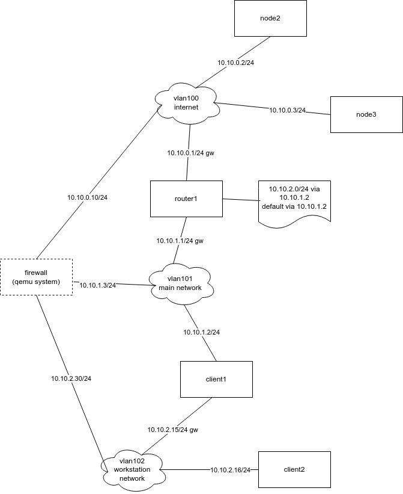

## pvete

This script manages the testenvironment defined by a drawing of the network created in drawio.

## Example network drawing

The network drawing needs to conform to a number of conventions in order to make a chance to be converted.

* Networks should be drawn using the cloud icon
  * They content should alway have the name "vlanxxxx" where xxxx is the vlan number
  * Any lines below the vlanxxxx can be comments and will be ignored
* Hosts should be drawn using the rectangle icon
  * The content should always have to name of the host on the first line
  * Any lines below the name can be comments and will be ignored
  * A host drawn with a dashed line will not be created as a container
* Network connections should be drawn as lines connecting a host to a network
* IP addresses must be text linked to the line connecting a host to a network
  * IP addresses should always be in CIDR notation
  * The IP address can be appended by the letter gw (space separated) when the system is the default gateway for that network
* Routing tables should be drawn using the document icon
  * Routing tables should be connected with a line to a host
  * Routing tables should contain "ip r a" compatable syntax, without the "ip r a"
  * Each routing entry has to be on a separate line
* Services should be drawn using the process icon
  * Service syntax should be:
    * port/protocol where protocol can be:
      * tcp
      * udp
    * commands to generate output to return to the client
  * Each line in a process icon is a serivce
  * Services that are not connected to a specific host will be deployed on all hosts
  * Services linked to 1 or more hosts will only be deployed on those hosts
  * Services are started with socat and the commands are started with SYSTEM. The commands are quoted with double quotes (""), so it is best to use single quotes within specified commands (see example drawing).

A network drawing can look like this:



## Configuration

In order for the drawing to be converted, the script needs a configuration file. The default name for
this configuration file is pvete.cfg and will be searched for in:
* Directory where the pvete script is located
* The homedirectory of the user, name of the configuration file will be prepended with a . (.pvete.cfg)

Additionally it is possible to change the name of the file and add the -c parameter to specify the name.

It is possible to have multiple configuration files in order to deploy multiple environments.

The example configuration file should be fairly obvious. A few options need further explanation.

CTSERVER

This is the Proxmox server that should be used to deploy the containers on. Make sure this system is
reachable by ssh and when doing so the login will be as root from the user running the script. Any
specific requirements to do this should be added to a ```~/.ssh/config``` file.

CTSHARED

This is a directory location on the Proxmox server that the script may create. This directory will be used
to store configuration information and scripts for all containers. It is shared between the containers
using a mountpoint.

CTTEMPLATE

This is the name of the template to use when creating a container. The create has an option to create the
template using DAB. This takes care of the requirements that are needed in the containers to make the
environment run smoothly.

CTJOBS

This is the parallellism that should be used when running tasks that can be run parallel (like restarting
containers). This defaults to 2.

PROXY

If set, the containers will be deployed to use the specified proxy for apt. The proxy should be reachable
from the configurated Proxmox server. The containers will not access the proxy directly, all connectivity
will run via the Proxmox server.

BRIDGE

Every network interface for a container will be assigned to a bridge. The vlan in the drawing will be used
as the vlan tag for the bridge. So the bridge should be vlan aware.
When integration the test environment with additional existing hosts, it can be useful to assign vlans to
specific bridges (existing hosts can then use vlan tagging).
There should always be a default bridge defined, so something like:
```
BRIDGE[default]="vmbr1000"
```
If specific vlans should not be assigned to the default bridge, additional configuration lines can be added,
mapping the vlans to a different bridge
```
BRIDGE[vmbr1001]="vlan200 vlan201 vlan202"
```

## Parsing

This is more of a test or debug feature. It allows for only parsing the drawing and generating configuration
information. It does not actually change or save anything. It shows some statistics and timing information,
which can be helpful to find problems.

```
pvete parse testing.drawio
Converting network drawing...done
Found 6 hosts, 3 networks, 15 links, 1 routing tables and 3 service lists.
Drawing parsing: 0.76 seconds
Generating container configuration...done
Configuration generation: 0.17 seconds
Total time: 0.92 seconds
```

## Deploying

Once a drawing is available and the configuration file has been made, deploying is quite easy (if it works).

```
pvete deploy testing.drawio
```

The script tries to read the drawing, generates all commands to run and runs the commands. After it is
finished, the containers should exist on the Proxmox server and should be running.

## Modifying

In larger test environment, destroying and re-deploying can take a lot of time. In order to try to minimize
the time to make modifications to the testenvironment, a modify option is available. This option will analyze
the supplied drawing and tries to detect the changes between it and the currently deployed environment.

Currently it should detect and modify:
* New or removed hosts
* Changed IP addresses
* New, removed or changed global or specific services
* New, removed or changed routing tables

The modify option will not try to modify a container configuration. If a change in the container configuration
is detected, the container will be removed and re-created.

With changed services or routes, only the containers affected by the change will be restarted.

The repository contains a ```testing-modified.drawio``` drawing which has the following modifications compared to the
```testing.drawio``` drawing:
* add node1
* remove client2
* change ip client1 in vlan102
* remove node3 service 9001/tcp
* remove node2 service 9000/tcp + 53/udp
* add router1 service 9000/tcp + 53/udp
* remove global service 443/dtls

After the environment in ```testing.drawio``` is deployed, modifications can be deployed through:

```
pvete modify testinng-modified.drawio
```

## Using the environment

The script provides a number of options to more easily manage the containers. But it is not mandatory to use
the script, the normal Proxmox commands can also be used.

The script tries to make it easier to quickly run commands in all containers, stop or start them all and
access a container based on the name of the container instead of the Proxmox container id.

## Testing services deployed with drawing testing.drawio

```
pvete enter node3
```

UDP
```
root@node3:~# echo input | socat -T1 udp:node2-vlan100:53 -
testing
```

DTLS
```
root@node3:~# echo input | socat -T1 openssl-dtls-client:node2-vlan100:443,verify=0 -
DTLS encrypted reply
```

TCP
```
root@node3:~# telnet node2-vlan100 9000
Trying 10.10.0.2...
Connected to node2-vlan100.
Escape character is '^]'.
HTTP/1.0 200 OK

Hello this is a test
Connection closed by foreign host.
```

TLS
```
root@node3:~# unset https_proxy
root@node3:~# curl -k https://node2-vlan100
Result output
```

## Cleaning up

Removing the containers can be done manually (but this will leave the shared directory and possibly the
proxy systemd unit file if a proxy is configured). The pvete script provides in a cleanup action which
will remove all containers, the shared directory and the systemd unit file.

```
pvete destroyall
```
