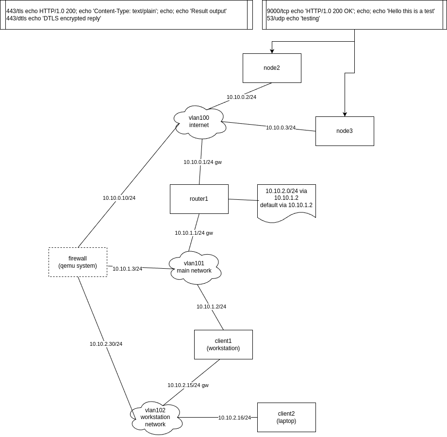

## PVE test environment

This is a set of scripts to convert a drawio network diagram to a set of Proxmox lxc
containers.

These scripts are pretty bad, have loads of assumptions and the parsing of the drawio
diagrams often leads to errors. But it works for me :)


## Features

The idea is to convert a network drawing made in drawio to a working set of lxc
containers. It currently has the following features:

* Conversion of drawio diagram to container creation commands (works sometimes) which converts the following information
  * System hostname
  * System IP address
  * Connected vlans, mapped to vmbr bridges
  * Configuration of default gateways
  * Configuration of routing tables
  * Creates shared storage between all containers
* Optional configuration of proxy access for package updates without additional network interfaces
* Exclusion of systems in the network diagram
* Automatic generation of /etc/hosts file based on nodes in drawing
* Container template generation based on DAB
  * Includes socat, iperf3, mtr, tcpdump and other useful test utilities
  * Embeds service that is started on boot

## Example network drawing

The network drawing needs to conform to a number of conventions in order to make a chance to be converted.

* Networks should be drawn using the cloud icon
  * They content should alway have the name "vlanxxxx" where xxxx is the vlan number
  * Any lines below the vlanxxxx can be comments and will be ignored
* Hosts should be drawn using the rectangle icon
  * The content should always have to name of the host on the first line
  * Any lines below the name can be comments and will be ignored
  * A host drawn with a dashed line will not be created as a container
* Network connections should be drawn as lines connecting a host to a network
* IP addresses must be text linked to the line connecting a host to a network
  * IP addresses should always be in CIDR notation
  * The IP address can be appended by the letter gw (space separated) when the system is the default gateway for that network
* Routing tables should be drawn using the document icon
  * Routing tables should be connected with a line to a host
  * Routing tables should contain "ip r a" compatable syntax, without the "ip r a"
  * Each routing entry has to be on a separate line
* Services should be drawn using the process icon
  * Service syntax should be:
    * port/protocol where protocol can be:
      * tcp
      * udp
    * commands to generate output to return to the client
  * Each line in a process icon is a serivce
  * Services that are not connected to a specific host will be deployed on all hosts
  * Services linked to 1 or more hosts will only be deployed on those hosts

A network drawing can look like this:



## Configuration

In order for the drawing to be converted, the script needs a configuration file. The default name for
this configuration file is pvete.cfg and will be searched for in:
* Directory where the pvete script is located
* The homedirectory of the user, name of the configuration file will be prepended with a . (.pvete.cfg)

Additionally it is possible to change the name of the file and add the -c parameter to specify the name.

It is possible to have multiple configuration files in order to deploy multiple environments.

The example configuration file should be fairly obvious. A few options need further explanation.

CTSERVER

This is the Proxmox server that should be used to deploy the containers on. Make sure this system is
reachable by ssh and when doing so the login will be as root from the user running the script. Any
specific requirements to do this should be added to a ```~/.ssh/config``` file.

CTSHARED

This is a directory location on the Proxmox server that the script may create. This directory will be used
to store configuration information and scripts for all containers. It is shared between the containers
using a mountpoint.

CTTEMPLATE

This is the name of the template to use when creating a container. The create has an option to create the
template using DAB. This takes care of the requirements that are needed in the containers to make the
environment run smoothly.

PROXY

If set, the containers will be deployed to use the specified proxy for apt. The proxy should be reachable
from the configurated Proxmox server. The containers will not access the proxy directly, all connectivity
will run via the Proxmox server.

BRIDGE

Every network interface for a container will be assigned to a bridge. The vlan in the drawing will be used
as the vlan tag for the bridge. So the bridge should be vlan aware.
When integration the test environment with additional existing hosts, it can be useful to assign vlans to
specific bridges (existing hosts can then use vlan tagging).
There should always be a default bridge defined, so something like:
```
BRIDGE[default]="vmbr1000"
```
If specific vlans should not be assigned to the default bridge, additional configuration lines can be added,
mapping the vlans to a different bridge
```
BRIDGE[vmbr1001]="vlan200 vlan201 vlan202"
```

## Deploying

Once a drawing is available and the configuration file has been made, deploying is quite easy (if it works).

```
pvete deploy testing.drawio
```

The script tries to read the drawing, generates all commands to run and runs the commands. After it is
finished, the containers should exist on the Proxmox server and should be running.

## Using the environment

The script provides a number of options to more easily manage the containers. But it is not mandatory to use
the script, the normal Proxmox commands can also be used.

The script tries to make it easier to quickly run commands in all containers, stop or start them all and
access a container based on the name of the container instead of the Proxmox container id.

## Cleaning up

Removing the containers can be done manually (but this will leave the shared directory and possibly the
proxy systemd unit file if a proxy is configured). The pvete script provides in a cleanup action which
will remove all containers, the shared directory and the systemd unit file.

```
pvete destroyall
```
